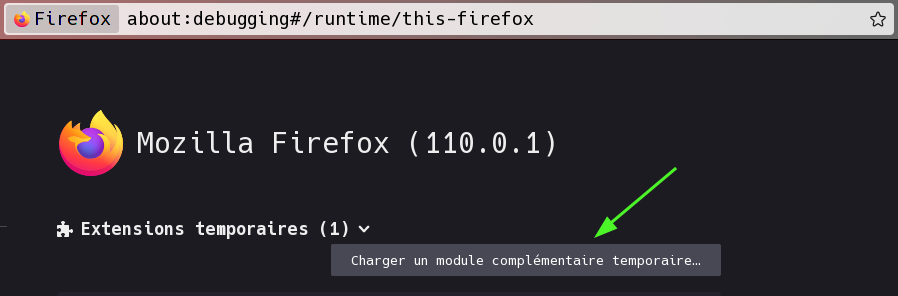
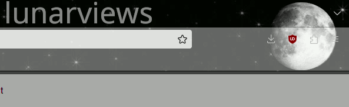
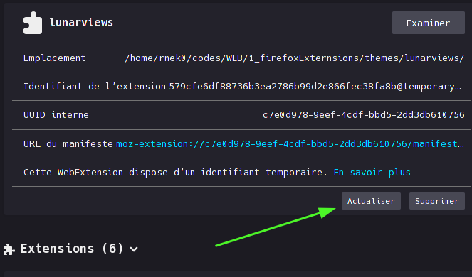

# Simple theme for firefox

Some images & french explanations about how to make a theme for webrowsers.

&nbsp;

## Creation d'un theme simple pour firefox

Dans cette serie on va s’intéresser aux themes et extensions des navigateurs. C'est assez proche des technos du web, il faut un peu de html, css, javascript et on peut avoir accès aux API fournies par les navigateurs.

On va dégrossir avec le plus simple, c'est à dire faire un theme pour changer un peu l'aspect de Firefox (ou Librewolf si vous préférez). Nous allons suivre le petit tuto ici: <https://extensionworkshop.com/documentation/themes/static-themes/>

---

&nbsp;

## Creation du dossier de travail

On crée un dossier de travail et on place à l’intérieur quelques fichiers 

* un fichier **manifest.json** 
* des fichiers image.

Détail du fichier .json

```json
{
    "manifest_version": 2,
    "version": "1.0",
    "name": "lunarviews",
    "theme": {
      "images": {
        "theme_frame": "header_lunarviews.png"
      },
      "colors": {
        "frame": "#000000",
        "tab_background_text": "#c0c0c0"
      }
    }
  }
```

---

&nbsp;

## Pour tester son thème

1. Ouvrir le navigateur et taper ceci dans la barre d'adresse : 

**about:debugging#/runtime/this-firefox**

2. Puis on click sur le bouton **Charger**



3. On selectionne le fichier **manifest.json**

&nbsp;

Et voici quelques résultats.



&nbsp;

Pour faire des changements et mises au point de votre travail vous avez seulement a laisser cet onglet ouvert et cliquer sur le bouton actualiser.



&nbsp; 

Et voila ! J'espère que cela vous a mis en appetit et que vous avez envie de faire des oeuvres d'art.  

Voir un peu de documentation : 

* <https://extensionworkshop.com/documentation/themes/static-themes/>
* <https://developer.chrome.com/docs/extensions/mv3/devguide/>

Faire des tests avec un outil :

* [Firefox Color](https://color.firefox.com/)
* [Firefox Color - Le Repo github](https://github.com/mozilla/FirefoxColor/)

---

&nbsp;

## Aller plus loin

**WebExtensions**  
Les extensions, ou modules complémentaires, peuvent étendre et modifier les fonctionnalités d'un navigateur. Les extensions pour Firefox sont construites avec l'API WebExtensions qui fonctionnent pour les différents navigateurs.

* La doc [sur Mozilla mdn](https://developer.mozilla.org/fr/docs/Mozilla/Add-ons/WebExtensions)  
* Votre première WebExtension [ici](https://developer.mozilla.org/fr/docs/Mozilla/Add-ons/WebExtensions/Your_first_WebExtension)

---

&nbsp;

Amusez vous bien et ...  
Happy Hacking ;)