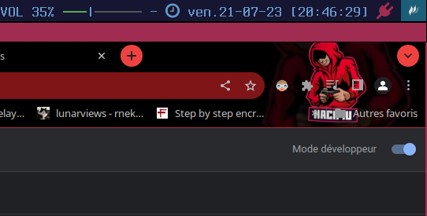
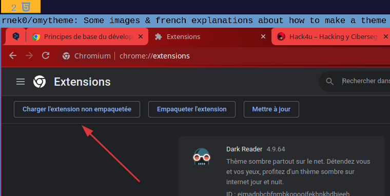

# Simple theme for Chromium

Some images & french explanations about how to make a theme for webrowsers.

&nbsp;

## Creation d'un theme simple pour Chromium

Dans cette série on va s’intéresser aux themes et extensions des navigateurs. C'est assez proche des technos du web, il faut un peu de html, css, javascript et on peut avoir accès aux API fournies par les navigateurs. Pour l'instant on s'occupe seulement des themes, [un thème est un type particulier d'extension](https://developer.chrome.com/docs/extensions/mv3/themes/) qui modifie l'apparence du navigateur. 

Comme j'utilise plusieurs browsers des que je peux je change l'aspect de ceux-ci à fin de comprendre rapidement avec lequel je me retrouve. Comme j'ai plusieurs activités qui réclament mon attention je me suis fait un peu de pub pour l’académie ou je suis des cours de Pentesting & Hacking (dans le bon sens du mot), voici donc comment faire un faire un theme pour changer un peu l'aspect de Chromium.  

---

&nbsp;

## Creation du dossier de travail

On crée un dossier de travail et on place à l’intérieur quelques fichiers 

* un fichier **manifest.json** 
* des fichiers image.

A la difference du manifest.json de Firefox ici les couleurs ne sont pas gérées en hexa mais en decimal puis il est un quand même different de celui de Firefox. J'ai fait quelques tests sur les images avant de comprendre comment je pouvais avoir un peu de transparence. Un [lien si vous ne connaissez pas le format .json](https://developer.mozilla.org/fr/docs/Glossary/JSON) pour vous éclairer un peu.

Détail du fichier .json

```json
{
  "manifest_version": 3,
  "version": "2.6",
  "name": "hack4u theme",
  "theme": {
    "images" : {
      "theme_frame_overlay" : "header_hack4ubg.png",
      "theme_toolbar" : "header_hack4ubg.png",
      "theme_ntp_background" : "background.png"
    },
    "colors" : {
      "frame" : [240, 65, 65],
      "toolbar" : [163, 16, 18],
      "ntp_text" : [20, 40, 0],
      "ntp_link" : [36, 70, 0],
      "ntp_section" : [207, 221, 192],
      "button_background" : [255, 0, 255] 
    },
    "tints" : {
      "buttons" : [0.33, 0.1, 0.7]
    },
    "properties" : {
      "ntp_background_alignment" : "bottom"
    }
  }
}
```

---

&nbsp;

## Pour tester son thème

1. Ouvrir le navigateur et taper ceci dans la barre d'adresse : 

**chrome://extensions**

2. Activez le **mode développeur** en cliquant sur le commutateur à côté de Mode développeur (en haut a droite) .




3. Pour tester son développement on sélectionne **le dossier** et non pas le **manifest.json** comme avec Firefox



&nbsp;

Pour faire des changements et mises au point de votre travail il faut répéter la procedure.


Et voila ! J'espère que cela vous a mis en appetit et que vous avez envie de faire des oeuvres d'art.  

Voir un peu de documentation : 

* <https://developer.chrome.com/docs/extensions/mv3/getstarted/development-basics/>
* <https://developer.chrome.com/docs/extensions/mv3/devguide/>

---

&nbsp;

## Aller plus loin

Si vous voulez partager vôtre joli theme sachez qu'il faut devenir développeur chrome et payer 5€ pour la suite; à vous de voir. Peut être un moyen pas trop cher de faire de la pub si vous êtes dans un modèle économique quelconque.

**WebExtensions**  
Les extensions, ou modules complémentaires, peuvent étendre et modifier les fonctionnalités d'un navigateur. Les extensions pour Firefox sont construites avec l'API WebExtensions qui fonctionnent pour les différents navigateurs, pour chromium je ne suis pas allé plus loin dans la recherche.

* La doc [sur Mozilla mdn](https://developer.mozilla.org/fr/docs/Mozilla/Add-ons/WebExtensions)  
* Votre première WebExtension [ici](https://developer.mozilla.org/fr/docs/Mozilla/Add-ons/WebExtensions/Your_first_WebExtension)

---

&nbsp;

Amusez vous bien et ...  
Happy Hacking ;)